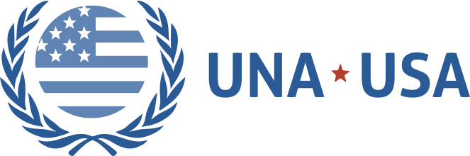
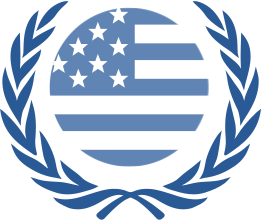

# UNA-USA Brand Guidelines

## [Primary Logo](images/UNA-USA_primary_logo.svg)

The **primary logo** should be used in all instances where space and layout allow. It includes the logotype and the mark with variations accomodating the short and long-form version of the name.

## [Stand-Alone Mark](images/UNA-USA_stand-alone_mark.svg)

The laurel and American flag mark can stand alone.

## TYPOGRAPHY

### Primary Typeface: Aller

**Aller Bold** should be applied to headlines and callouts.

- [Aller Light]()
- [Aller Light Italic](fonts/Aller/Aller_LtIt.woff)
- [Aller Regular](fonts/Aller/Aller_Rg.woff)
- [Aller Regular Italic](fonts/Aller/Aller_It.woff)
- [Aller Bold](fonts/Aller/Aller_Bd.woff)
- [Aller Bold Italic](fonts/Aller/Aller_BdIt.woff)
- [Aller Display](fonts/Aller/AllerDisplay.woff)

### Secondary Typeface: Avenir

**Avenir** should be used for long-form text like body copy. 

- [Avenir Light](fonts/Avenir/Avenir-Light.woff)
- [Avenir Roman](fonts/Avenir/Avenir-Book.woff)
- [Avenir Roman Oblique](fonts/Avenir/Avenir-Book.woff)
- [Avenir Medium](fonts/Avenir/Avenir-BookOblique.woff)
- [Avenir Heavy](fonts/Avenir/Avenir-heavy.woff)
- [Avenir Heavy Oblique](fonts/Avenir/Avenir-HeavyOblique.woff)
- [Avenir Black](fonts/Avenir/Avenir-Black.woff)

## COLORS

### Primary Colors

- UN Blue (light blue): #5B91E5
- UNA-USA Blue (dark blue): #2663AA

### Secondary Colors

**Secondary colors** should be used as accent colors. 

- Red: #CC3A28
- Green: #5EBA47
- Orange: #F26A37
- Cyan: #009A98
- Yellow: #F8BF2C
- Purple: #4F40AB
